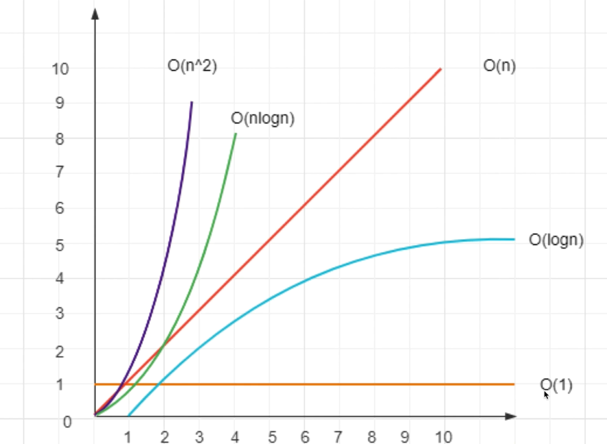

## 复杂度

### 什么是复杂度
* 程序执行时需要的计算量和内存空间（与代码是否简洁无关），需要的计算量即时间复杂度，需要的内存空间即空间复杂度
* 复杂度是个数量级，而不是具体的数字，用 O(...) 表示，内部是一个函数表达式
* 前端领域一般重时间轻空间

### 复杂度的比较
1. 图例，其中横轴为原始数据输入量，纵轴为复杂度：

### 时间复杂度的数量级
* O(1)：和输入量无关，一直是固定的，即有限的、可数的
* O(logn)：数据量的对数
* O(n)：和输入的数据量相同
* O(n*logn)：数据量 * 数据量的对数
* O(n^2)：数据量的平方

### 空间复杂度的数量级
* O(1)：和输入量无关，一直是固定的，即有限的、可数的
* O(n)：和输入的数据量相同